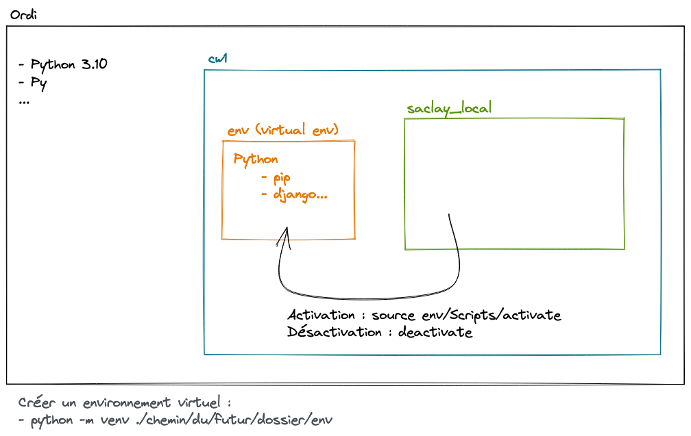

# Créer un environnement virtuel Python

## Pourquoi créer un environnement virtuel ?

Plusieurs raisons possibles :

- la commande `python` renvoie vers un interpréteur qui n'est pas celui que je veux.
- j'installe une commande avec pip, mais je ne peux pas l'utiliser
- je veux pourvoir partager une même version de python et des paquets
- je veux pouvoir isoler les paquets que je crée dans un environnement pour éviter les conflits de version entre les projets

## Comment le créer ?

`python -m venv {chemin/où/positionner/mon/env}` => créer l'environnement virtuel nommé à l'endroit souhaité

## Comment l'activer ?

Pour l'activer et faire en sorte que les commandes `python`ou `pip` sont celles de l'environnement virtuel, il faut l'activer.

MacOS / Linux : `source ./chemin/vers/mon/env/bin/activate`
Windows : `source .\chemin\vers\mon\env\Scripts\activate`

## Pour le désactiver

`deactivate`

---

